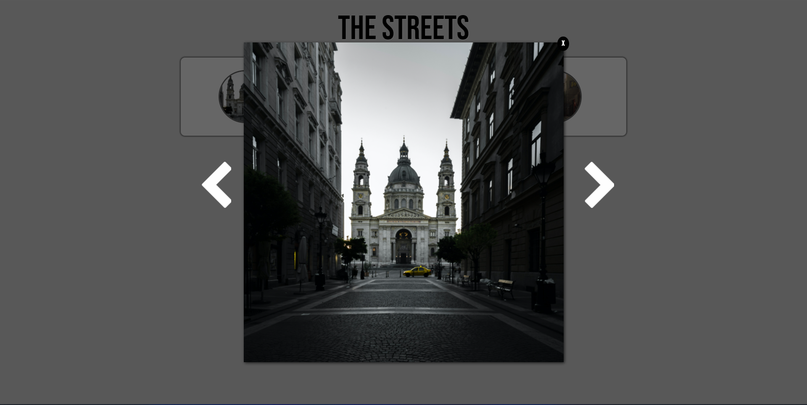

# Basic HTML & CSS

This practice is for HTML & CSS basic. Create a streets photo gallery + lightbox, **inspired by** [lokeshdhakar](https://lokeshdhakar.com/projects/lightbox2/)

In this practice, focus on CSS especially CSS3.

## Learn about :

- CSS Reset [link](https://meyerweb.com/eric/tools/css/reset/)
- Font styling
- CSS Layouting - Float
- CSS Layouting - Position
- Micro Clear Fix Hack [link](http://nicolasgallagher.com/micro-clearfix-hack/)
- CSS3 - Opacity
- CSS3 - RGBa
- CSS3 - Box Shadow
- CSS3 - Text Shadow
- CSS3 - Font Face - import [BebasNeue Font](https://www.fontsquirrel.com/fonts/bebas-neue) with format **woff2**
- CSS3 - Transform
- CSS3 - Animation & Transition

## Result of Practice

